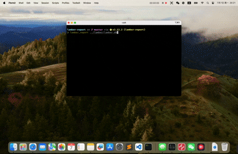
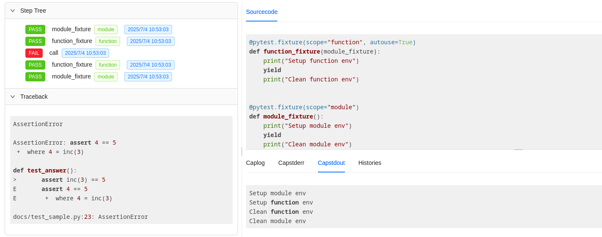
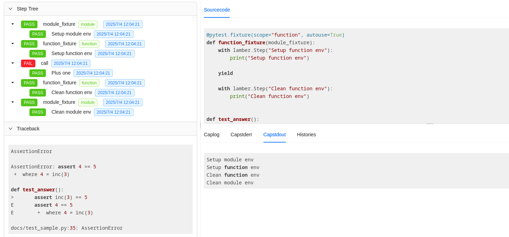
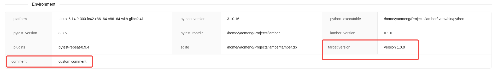

# Lamber
Lamber collects [pytest](https://github.com/pytest-dev/pytest) execution data([models](./src/lamber/models.py)), provides consumption interfaces([hooks](./src/lamber/hooks.py)), and allows users to integrate custom data.

## Installation
```bash
pip install lamber
```

### Dependencies
* python >= 3.10
* pytest >= 8.3.5

## Test report based on Sqlite3
Lamber supports saving data to Sqlite3 database. Specify the db file(`lamber.db`) **directory** to be saved through `--lamber-sqlite-dir` commandline.

> [lamber-report](https://github.com/luizyao/lamber-report) is a test report tool developed based on this feature.
>

## Support original pytest script
A typical pytest script is as follows:

```python
import pytest


@pytest.fixture(scope="module")
def module_fixture():
    print("Setup module env")
    yield
    print("Clean module env")


@pytest.fixture(scope="function", autouse=True)
def function_fixture(module_fixture):
    print("Setup function env")
    yield
    print("Clean function env")


def inc(x):
    return x + 1


def test_answer():
    assert inc(3) == 5
```
* It contains `module` and `function` fixtures.

The generated test report is as follows：



* It contains the step tree, error traceback, script sourcecode and logs.
* The calling relationship of the pytest fixtures will also be displayed in the Step Tree. This feature can be disabled by using the `--lamber-ignore-fixture-step` commandline.

## Update the original pytest script
Lamber introduces the Step concept, supports two usage methods: the **context manager**(`with lamber.step:`) and the **decorator**(`@lamber.step `).

```python
import pytest

import lamber


@pytest.fixture(scope="module")
def module_fixture():
    with lamber.Step("Setup module env"):
        print("Setup module env")

    yield

    with lamber.Step("Clean module env"):
        print("Clean module env")


@pytest.fixture(scope="function", autouse=True)
def function_fixture(module_fixture):
    with lamber.Step("Setup function env"):
        print("Setup function env")

    yield

    with lamber.Step("Clean function env"):
        print("Clean function env")


# Step decorator
@lamber.step("Plus one")
def inc(x):
    return x + 1


def test_answer():
    assert inc(3) == 5
```

The generated test report is as follows:



## Support custom environment items
Lamber supports integrating custom environment items(the target version, comments, etc.) through `pytest_lamber_report_environment` hook.

```python
# conftest.py

def pytest_lamber_report_environment() -> dict:
    return {
        "target version": "version 1.0.0",
        "comment": "custom comment",
    }

```

The generated test report is as follows:



## Support custom attachments

### Image
Take a screenshot automatically when the test case fails through [playwright](https://github.com/microsoft/playwright-pytest).

```python
# conftest.py

import pytest
from playwright.sync_api import Page

from lamber import AttachmentType
from lamber.models import TestCase


@pytest.fixture(autouse=True)
def auto_screenshot(page: Page, request: pytest.FixtureRequest):
    yield

    failed = hasattr(request.node, "rep_call") and request.node.rep_call.failed or True
    if failed:
        test_case: TestCase = request.node._lamber_test_case
        test_case.attach(
            "screenshot",
            page.screenshot(full_page=True),
            type=AttachmentType.PNG,
        )
```

The generated test report is as follows:


## LICENSE
[MIT LICENSE](./LICENSE.txt)
